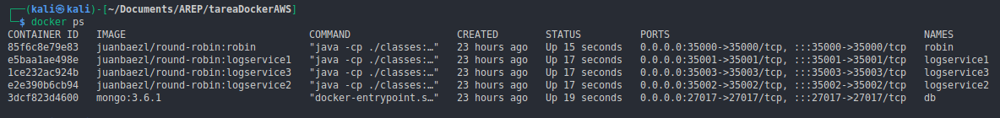

# Titulo

Docker AWS

## Descripción

En este repositorio encontrará una aplicacion con la siguiente arquitectura:


### Prerrequisitos

Para correr este se debe tener instalado:

- Maven
- Docker
- Java

### Guía de uso

Para compilar y ejecutar el proyecto se debe usar el siguiente bloque de codigo:

```
cd log-service
mvn package
cd ..
cd reound-robin
mvn package
cd ..
docker-compose up -d --build
```

Una vez ejecute este comando podrá ingresar al servidor web desde su navegador con la siguiente ruta http://localhost:35000.

En esta pantalla podra guardar el valor en la base de datos pasando por los logservices para guardar la informacion en la base de datos, ahi le dara la respuesta de los ultimos 10 valores guardados con su fecha y su id

## Integracion AWS

En caso de querer subirlo a AWS se puede encontrar en el siguiente repositorio de docker hub [Round-Robin](https://hub.docker.com/repository/docker/juanbaezl/round-robin/general)

## Proceso

Desplegando la aplicación como se indica en la guía de uso, comprobamos que los servicios esten corriendo con docker ps, y que se encuentren en el puerto 35000, 35001, 35002 y 35003.



Una vez esten corriendo los servicios, podemos ingresar a la aplicación desde el navegador con la ruta http://localhost:35000, y podemos ver que se encuentra corriendo.


ingresamos un valor y le damos guardar, y nos muestra los ultimos 10 valores guardados.


Estos valores los entregarán los diferentes logservices y a su vez estos se conectaran a la base de datos para guardar los valores.

## Autor

- **Juan Carlos Baez Lizarazo** - [juanbaezl](https://github.com/juanbaezl)

## Fecha

Octubre, 2022

## Licencia

Para más información ver: [LICENSE.txt](License.txt)
